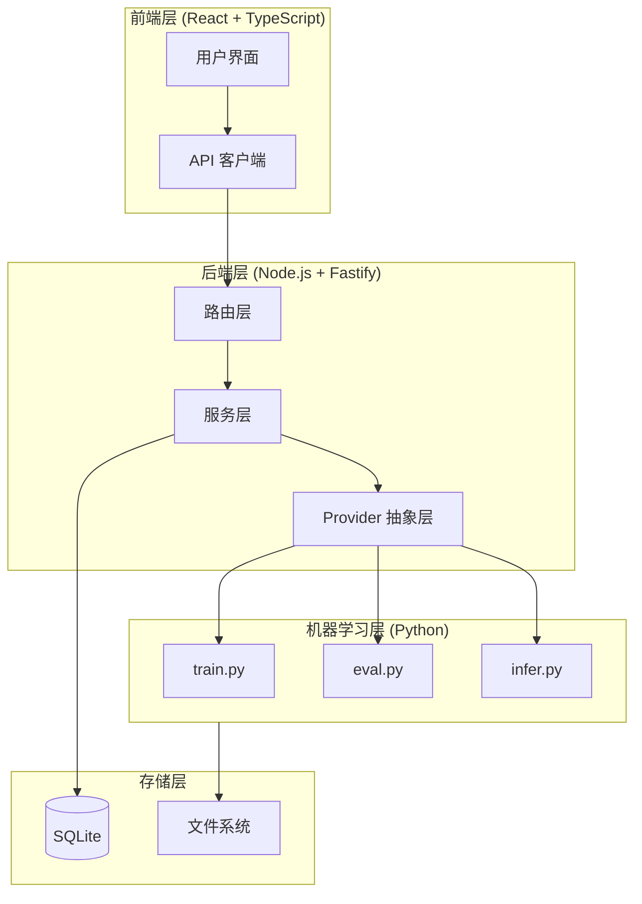
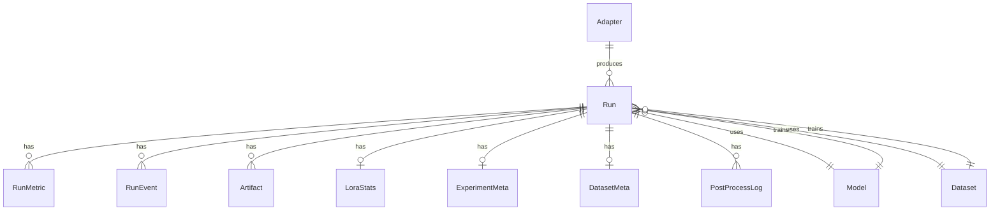
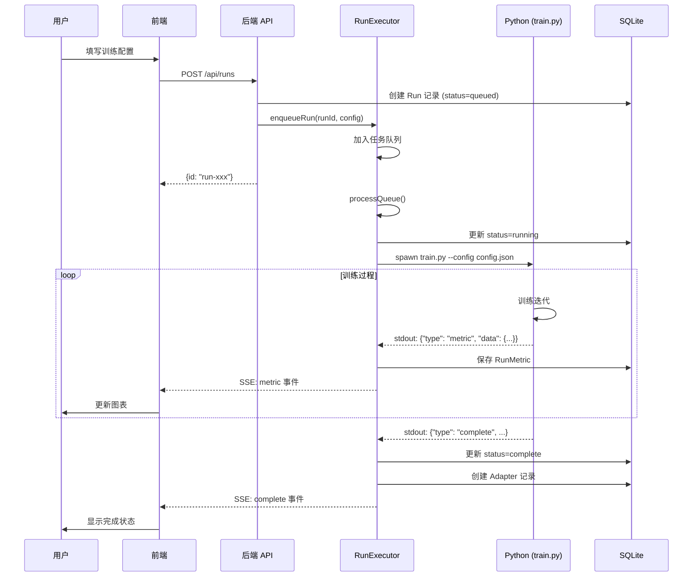
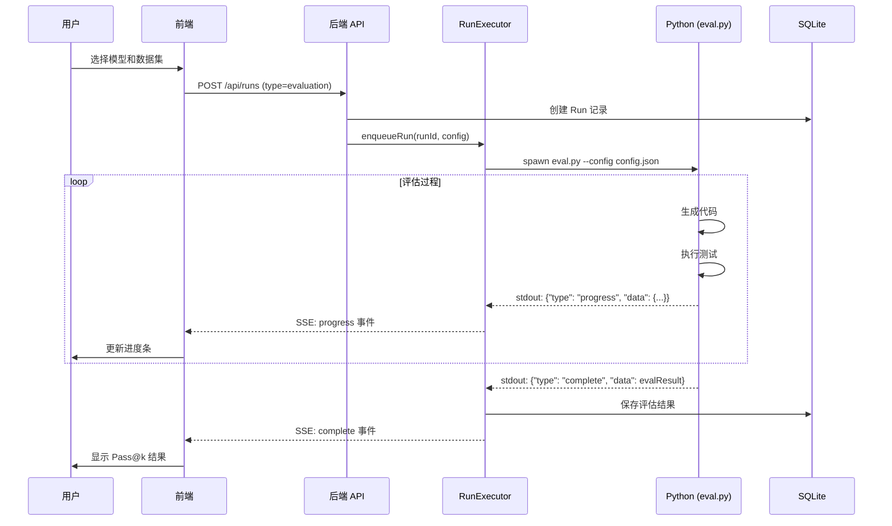

# LLMTrainPipeline 项目技术文档

> **端到端大语言模型微调与评估流水线系统**
> 
> 本文档详细介绍该项目的架构设计、技术栈、核心算法、工作流程及实现原理，适用于学术论文参考。

---

## 目录

1. [项目概述](#1-项目概述)
2. [系统架构](#2-系统架构)
3. [技术栈详解](#3-技术栈详解)
4. [数据库设计](#4-数据库设计)
5. [核心模块详解](#5-核心模块详解)
6. [训练流程与算法](#6-训练流程与算法)
7. [评估流程与指标](#7-评估流程与指标)
8. [数据格式支持](#8-数据格式支持)
9. [配置参数详解](#9-配置参数详解)
10. [API 接口设计](#10-api-接口设计)
11. [前端界面设计](#11-前端界面设计)
12. [工作流程图](#12-工作流程图)

---

## 1. 项目概述

### 1.1 项目目标

LLMTrainPipeline 是一个**端到端的大语言模型微调与评估流水线系统**，旨在提供：

- 🎯 **模型训练**：基于 LoRA/QLoRA 的高效参数微调
- 📊 **模型评估**：Pass@k 代码生成评估与错误分类分析
- 📈 **实时监控**：训练指标实时追踪与可视化
- 📝 **报告生成**：自动生成详细的学术级训练报告
- 🔧 **模型推理**：交互式代码生成测试 Playground
- 📁 **数据管理**：多格式数据集自动检测与转换

### 1.2 设计理念

```
┌─────────────────────────────────────────────────────────────────┐
│                         用户界面层 (React)                        │
│  Dashboard │ NewRun │ Runs │ Evaluation │ Playground │ Compare  │
└─────────────────────────────────────────────────────────────────┘
                              ▼
┌─────────────────────────────────────────────────────────────────┐
│                       API 网关层 (Fastify)                        │
│   /runs │ /models │ /datasets │ /adapters │ /reports │ /playground│
└─────────────────────────────────────────────────────────────────┘
                              ▼
┌─────────────────────────────────────────────────────────────────┐
│                        服务层 (TypeScript)                        │
│    RunExecutor │ AdapterGuard │ NotificationService │ Scanner   │
└─────────────────────────────────────────────────────────────────┘
                              ▼
┌─────────────────────────────────────────────────────────────────┐
│                      Provider 抽象层                              │
│  TrainerProvider(LoRA) │ EvalProvider(PassK) │ Cache │ Artifact │
└─────────────────────────────────────────────────────────────────┘
                              ▼
┌─────────────────────────────────────────────────────────────────┐
│                       ML 执行层 (Python)                          │
│        train.py │ eval.py │ infer.py │ report_generator.py      │
└─────────────────────────────────────────────────────────────────┘
                              ▼
┌─────────────────────────────────────────────────────────────────┐
│                       数据持久层                                   │
│              SQLite (Prisma ORM) │ 文件系统 (storage/)            │
└─────────────────────────────────────────────────────────────────┘
```

---

## 2. 系统架构

### 2.1 整体架构图



### 2.2 目录结构

```
LLMTrainPipeline/
├── App.tsx                 # React 应用入口
├── pages/                  # 前端页面组件 (13个)
│   ├── Dashboard.tsx       # 仪表盘
│   ├── NewRun.tsx          # 新建训练任务
│   ├── RunDetail.tsx       # 训练详情
│   ├── Evaluation.tsx      # 评估任务
│   ├── EvalDetail.tsx      # 评估详情
│   ├── Playground.tsx      # 模型推理测试
│   ├── Compare.tsx         # 运行对比
│   ├── Models.tsx          # 模型管理
│   ├── Datasets.tsx        # 数据集管理
│   ├── Adapters.tsx        # 适配器管理
│   ├── Reports.tsx         # 报告管理
│   ├── Runs.tsx            # 运行列表
│   └── Settings.tsx        # 系统设置
├── components/             # 公共组件
│   ├── Layout.tsx          # 布局组件
│   ├── CommandPalette.tsx  # 命令面板
│   └── NotificationPanel.tsx # 通知面板
├── lib/
│   └── api.ts              # API 客户端 (50+ 函数)
├── backend/
│   ├── src/
│   │   ├── index.ts        # Fastify 服务入口
│   │   ├── routes/         # API 路由 (13个模块)
│   │   ├── services/       # 业务服务 (6个)
│   │   ├── providers/      # Provider 抽象层
│   │   ├── config/         # 配置管理
│   │   └── types/          # 类型定义
│   ├── scripts/            # Python ML 脚本
│   │   ├── train.py        # 训练脚本 (926行)
│   │   ├── eval.py         # 评估脚本 (2139行)
│   │   ├── infer.py        # 推理脚本
│   │   ├── format_registry.py  # 数据格式注册表 (1055行)
│   │   └── report_generator.py # 报告生成器 (2205行)
│   ├── prisma/
│   │   └── schema.prisma   # 数据库模型 (16个)
│   └── storage/            # 数据存储目录
│       ├── models/         # 基座模型权重
│       ├── adapters/       # LoRA 适配器
│       ├── datasets/       # 训练数据集
│       └── runs/           # 训练运行记录
└── package.json            # 项目配置
```

---

## 3. 技术栈详解

### 3.1 前端技术栈

| 技术 | 版本 | 用途 |
|------|------|------|
| **React** | 19.2.3 | UI 框架 |
| **TypeScript** | 5.8.2 | 类型安全 |
| **Vite** | 6.2.0 | 构建工具 |
| **React Router** | 7.12.0 | 路由管理 |
| **Recharts** | 3.6.0 | 图表可视化 |
| **React Markdown** | 10.1.0 | Markdown 渲染 |
| **React Syntax Highlighter** | 16.1.0 | 代码高亮 |

### 3.2 后端技术栈

| 技术 | 版本 | 用途 |
|------|------|------|
| **Node.js** | ≥18.0.0 | 运行时 |
| **Fastify** | 4.27.0 | Web 框架 |
| **Prisma** | 5.14.0 | ORM 数据库访问 |
| **SQLite** | - | 嵌入式数据库 |
| **Zod** | 3.23.8 | 数据验证 |
| **UUID** | 9.0.1 | 唯一标识生成 |
| **Archiver** | 7.0.1 | 压缩打包 |

### 3.3 机器学习技术栈

| 技术 | 版本要求 | 用途 |
|------|----------|------|
| **Python** | ≥3.11 | 编程语言 |
| **PyTorch** | ≥2.0.0 | 深度学习框架 |
| **Transformers** | ≥4.36.0 | 预训练模型库 |
| **PEFT** | ≥0.7.0 | LoRA/QLoRA 实现 |
| **TRL** | 最新版 | SFTTrainer 训练器 |
| **bitsandbytes** | ≥0.41.0 | 量化支持 |
| **Accelerate** | ≥0.25.0 | 分布式训练 |
| **Datasets** | ≥2.15.0 | 数据集加载 |

---

## 4. 数据库设计

### 4.1 核心数据模型 (Prisma Schema)

系统使用 SQLite 数据库，通过 Prisma ORM 进行访问。共定义 **16 个数据模型**：

#### 4.1.1 Run（训练/评估运行）

```prisma
model Run {
  id              String           @id @default(uuid())
  name            String           # 运行名称
  type            String           # "training" | "evaluation"
  status          String           @default("queued")  # queued/running/complete/failed
  createdAt       DateTime         @default(now())
  startedAt       DateTime?
  completedAt     DateTime?
  duration        String?
  
  modelId         String           # 关联基座模型
  datasetId       String           # 关联数据集
  evalDatasetId   String?          # 评估数据集（可选）
  profileName     String           @default("single_gpu")
  configJson      String           # 完整配置 JSON
  metricsJson     String?          # 训练指标摘要
  evalResultJson  String?          # 评估结果
  
  seed            Int?             # 随机种子
  gitCommit       String?          # Git 提交哈希
  totalTokens     Int?             # 总 Token 数
  totalSteps      Int?             # 总训练步数
  gpuHours        Float?           # GPU 使用时长
  tokensPerSecond Float?           # 吞吐量
  sourceRunId     String?          # 源训练运行 ID
  queuePosition   Int?             # 队列位置
  
  # 关联关系
  artifacts       Artifact[]
  metrics         RunMetric[]
  events          RunEvent[]
  loraStats       LoraStats?
  experimentMeta  ExperimentMeta?
  datasetMeta     DatasetMeta?
}
```

#### 4.1.2 Model（模型）

```prisma
model Model {
  id           String   @id @default(uuid())
  name         String   @unique
  backend      String   # "transformers"
  source       String   # "local" | "huggingface"
  quantization String   # "none" | "4bit" | "8bit"
  params       String   # 参数量描述
  path         String   # 模型路径
  status       String   @default("valid")
  metaJson     String?  # 元信息 JSON
}
```

#### 4.1.3 Dataset（数据集）

```prisma
model Dataset {
  id        String   @id @default(uuid())
  name      String   @unique
  version   String
  type      String   # "train" | "eval"
  status    String   @default("ready")
  samples   Int      # 样本数量
  format    String   # 数据格式
  size      String   # 文件大小
  path      String   # 文件路径
  hash      String   # 文件哈希
}
```

#### 4.1.4 Adapter（LoRA 适配器）

```prisma
model Adapter {
  id           String   @id @default(uuid())
  name         String   @unique
  baseModel    String   # 基座模型名称
  trainDataset String   # 训练数据集
  rank         Int      # LoRA rank
  alpha        Int      # LoRA alpha
  status       String   @default("success")
  passAt1      Float?   # Pass@1 评估结果
  compileRate  Float?   # 编译通过率
  path         String?  # 适配器路径
}
```

#### 4.1.5 LoraStats（LoRA 统计）

```prisma
model LoraStats {
  id               String  @id @default(uuid())
  runId            String  @unique
  rank             Int?
  alpha            Int?
  dropout          Float?
  targetModules    String? # JSON 数组
  trainableParams  BigInt? # 可训练参数数量
  totalParams      BigInt? # 总参数数量
  trainablePercent Float?  # 可训练比例
}
```

#### 4.1.6 ExperimentMeta（实验元数据）

```prisma
model ExperimentMeta {
  id                  String    @id @default(uuid())
  runId               String    @unique
  osVersion           String?
  pythonVersion       String?
  pytorchVersion      String?
  transformersVersion String?
  trlVersion          String?
  peftVersion         String?
  cudaVersion         String?
  cudnnVersion        String?
  bitsandbytesVersion String?
  gpuModel            String?
  gpuMemoryGB         Float?
  cpuModel            String?
  ramGB               Float?
  startTime           DateTime?
  endTime             DateTime?
}
```

### 4.2 ER 关系图



---

## 5. 核心模块详解

### 5.1 后端服务层 (services/)

#### 5.1.1 RunExecutor（任务执行器）

**文件**: `backend/src/services/run-executor.ts` (1539 行)

核心职责：
- **任务队列管理**：维护内存队列 `runQueue[]`，支持任务排队、重排序、取消
- **日志缓冲**：使用 `LogEventBuffer` 批量写入日志，解决 SQLite 高频写入压力
- **进程管理**：通过 `spawn` 启动 Python 脚本，支持实时 stdout 解析
- **事件分发**：使用 `EventEmitter` 实现 SSE 实时日志推送

关键函数：

```typescript
// 任务入队
async function enqueueRun(runId: string, profileName: string, configOverride: any): Promise<void>

// 队列处理
async function processQueue(): Promise<void>

// 执行运行（训练/评估）
async function executeRun(runId: string, config: Config): Promise<void>

// 停止运行
async function stopRun(runId: string): Promise<void>

// 获取队列状态
function getQueueStatus(): { queueLength: number; isProcessing: boolean }
```

#### 5.1.2 AdapterGuard（适配器守护）

**文件**: `backend/src/services/adapter-guard.ts`

职责：启动时验证所有 LoRA 适配器文件完整性，标记无效适配器。

#### 5.1.3 NotificationService（通知服务）

**文件**: `backend/src/services/notification-service.ts`

职责：任务完成/失败时创建通知，支持前端实时提醒。

### 5.2 Provider 抽象层 (providers/)

#### 5.2.1 接口定义

**文件**: `backend/src/providers/interfaces.ts`

```typescript
// 训练 Provider 接口
interface TrainerProvider {
    name: string;
    train(config: TrainConfig): AsyncGenerator<TrainEvent>;
    stop?(): void;
}

// 评估 Provider 接口
interface EvalProvider {
    name: string;
    evaluate(config: EvalConfig): Promise<EvalResult>;
    evaluateStream?(config: EvalConfig): AsyncGenerator<EvalEvent, EvalResult, unknown>;
    stop?(): void;
}

// 训练事件
interface TrainEvent {
    type: 'log' | 'metric' | 'checkpoint' | 'complete' | 'error' | 
          'experiment_log' | 'eval_log' | 'data_quality' | 'training_summary';
    timestamp: Date;
    data: any;
}

// 评估结果
interface EvalResult {
    passAt1: number;
    compileRate: number;
    passAtK: Record<string, number>;
    errorStats?: ErrorStats;
    timeStats?: TimeStats;
    segmentStats?: {
        byDifficulty: Record<string, SegmentResult>;
        byCategory: Record<string, SegmentResult>;
    };
    failures: FailureCase[];
}
```

#### 5.2.2 LoraTrainer（LoRA 训练器）

**文件**: `backend/src/providers/trainer/lora.ts` (467 行)

职责：
- 构建训练配置 JSON
- 启动 `train.py` Python 进程
- 解析 stdout 输出的 JSON 事件
- 通过 AsyncGenerator 流式返回训练事件

```typescript
class LoraTrainer implements TrainerProvider {
    name = 'lora';
    
    async *train(trainConfig: TrainConfig): AsyncGenerator<TrainEvent> {
        // 1. 生成配置文件
        // 2. spawn train.py 进程
        // 3. 解析 stdout JSON 事件
        // 4. yield TrainEvent
    }
}
```

#### 5.2.3 CodePassKEval（代码评估器）

**文件**: `backend/src/providers/eval/code-passk.ts` (636 行)

职责：
- 启动 `eval.py` Python 进程
- 实时流式返回评估进度和问题结果
- 解析最终评估结果

---

## 6. 训练流程与算法

### 6.1 训练脚本架构

**文件**: `backend/scripts/train.py` (926 行)

```python
# 主入口
def train(config: dict):
    """
    主训练函数
    1. 初始化 ExperimentLogger
    2. 加载模型和 tokenizer
    3. 配置 LoRA 适配器
    4. 准备数据集（messages 格式）
    5. 使用 TRL SFTTrainer 训练
    6. 输出实验日志
    """
```

### 6.2 LoRA/QLoRA 配置

```python
def setup_lora(model, lora_config: dict):
    """
    LoRA 配置参数:
    - rank: 16 (默认)
    - alpha: 32 (默认)
    - dropout: 0.05 (默认)
    - target_modules: ["q_proj", "k_proj", "v_proj", "o_proj", 
                       "gate_proj", "up_proj", "down_proj"]
    - bias: "none"
    """
    peft_config = LoraConfig(
        task_type=TaskType.CAUSAL_LM,
        r=rank,
        lora_alpha=alpha,
        lora_dropout=dropout,
        target_modules=target_modules,
        bias=bias,
    )
    model = get_peft_model(model, peft_config)
    return model
```

### 6.3 量化配置

```python
def get_quantization_config(quantization: str):
    """
    支持 3 种量化模式:
    - "4bit" (QLoRA): NF4 量化，使用 double quantization
    - "8bit": INT8 量化，支持 CPU offload
    - "none": FP16 全精度
    """
    if quantization == "4bit":
        return BitsAndBytesConfig(
            load_in_4bit=True,
            bnb_4bit_quant_type="nf4",
            bnb_4bit_compute_dtype=torch.float16,
            bnb_4bit_use_double_quant=True,
        )
```

### 6.4 训练参数

| 参数 | 默认值 | 说明 |
|------|--------|------|
| `epochs` | 3 | 训练轮数 |
| `batchSize` | 1 | 每设备批次大小 |
| `gradientAccumulation` | 8 | 梯度累积步数 |
| `lr` | 2e-4 | 学习率 |
| `maxLength` | 512 | 最大序列长度 |
| `weightDecay` | 0.01 | 权重衰减 |
| `warmupRatio` | 0.03 | 预热比例 |
| `scheduler` | "cosine" | 学习率调度器 |
| `optimizer` | "paged_adamw_8bit" | 优化器 |
| `loggingSteps` | 10 | 日志记录间隔 |
| `saveSteps` | 100 | 检查点保存间隔 |
| `saveTotalLimit` | 3 | 最大检查点保留数 |
| `gradientClipping` | 1.0 | 梯度裁剪阈值 |

### 6.5 TRL SFTTrainer 训练器

```python
def train_with_sft(model, tokenizer, dataset, eval_dataset, output_dir, config):
    """
    使用 TRL SFTTrainer 进行训练
    
    关键特性:
    - 自动 loss masking（仅在 assistant 回复上计算 loss）
    - 支持 messages 格式数据集
    - 内置 gradient checkpointing
    - 支持早停回调
    """
    sft_config = SFTConfig(
        output_dir=output_dir,
        num_train_epochs=num_epochs,
        per_device_train_batch_size=batch_size,
        gradient_accumulation_steps=grad_accum,
        learning_rate=learning_rate,
        gradient_checkpointing=True,
        # ... 更多配置
    )
    
    trainer = SFTTrainer(
        model=model,
        args=sft_config,
        train_dataset=dataset,
        eval_dataset=eval_dataset,
        processing_class=tokenizer,
        callbacks=[TrainingEventCallback()],
    )
    
    trainer.train()
```

### 6.6 训练事件回调

```python
class TrainingEventCallback(TrainerCallback):
    """
    训练事件回调，输出 JSON 格式事件到 stdout
    供 TypeScript 后端解析
    """
    
    def on_log(self, args, state, control, logs=None, **kwargs):
        # 输出 metric 事件
        event = {
            "type": "metric",
            "data": {
                "step": state.global_step,
                "loss": logs.get('loss'),
                "lr": logs.get('learning_rate'),
                "grad_norm": logs.get('grad_norm'),
                "epoch": logs.get('epoch')
            }
        }
        print(json.dumps(event), flush=True)
    
    def on_save(self, args, state, control, **kwargs):
        # 输出 checkpoint 事件
        event = {
            "type": "checkpoint",
            "data": {
                "path": f"checkpoint-{state.global_step}",
                "step": state.global_step,
                "epoch": state.epoch
            }
        }
        print(json.dumps(event), flush=True)
```

---

## 7. 评估流程与指标

### 7.1 评估脚本架构

**文件**: `backend/scripts/eval.py` (2139 行)

### 7.2 核心评估指标

#### 7.2.1 Pass@k 计算

```python
def pass_at_k(n: int, c: int, k: int) -> float:
    """
    计算 Pass@k 估计值
    
    参数:
        n: 每个问题的样本数
        c: 通过的样本数
        k: k 值
    
    返回:
        Pass@k 概率估计
    
    公式: 1 - C(n-c, k) / C(n, k)
    """
    if n - c < k:
        return 1.0
    return 1.0 - comb(n - c, k) / comb(n, k)
```

#### 7.2.2 错误类型分类

```python
class ErrorType(Enum):
    """错误类型枚举"""
    NONE = "none"
    SYNTAX_ERROR = "syntax_error"       # 语法错误
    RUNTIME_ERROR = "runtime_error"     # 运行时错误
    TIMEOUT = "timeout"                 # 超时
    INVALID_OUTPUT = "invalid_output"   # 输出格式错误
    ASSERTION_ERROR = "assertion_error" # 断言失败
    IMPORT_ERROR = "import_error"       # 导入错误
    MEMORY_ERROR = "memory_error"       # 内存错误
```

#### 7.2.3 评估结果结构

```python
@dataclass
class EvalResult:
    # 基础指标
    pass_at_1: float           # Pass@1
    pass_at_5: float           # Pass@5
    pass_at_10: float          # Pass@10
    compile_rate: float        # 编译通过率
    
    # 错误统计
    error_stats: ErrorStats
    
    # 时间统计
    time_stats: TimeStats
    
    # 分段统计（按难度/类别）
    segment_stats: Dict[str, SegmentResult]
    
    # 失败案例
    failures: List[FailureCase]
```

### 7.3 代码执行与验证

#### 7.3.1 双风格代码支持

系统支持**函数式**和 **stdin/stdout 式**两种代码风格：

```python
def _adapt_code_for_stdin_test(code: str, inp: str) -> str:
    """
    智能适配代码风格
    
    当模型生成函数式代码（如 def solve(...)），
    但测试期望 stdin/stdout 风格时，
    自动生成包装器代码。
    """
    has_def = bool(re.search(r'\bdef\s+\w+\s*\(', code))
    has_input = bool(re.search(r'\binput\s*\(', code))
    has_print = bool(re.search(r'\bprint\s*\(', code))
    
    if has_def and not has_input:
        # 函数式代码，需要添加包装器
        return _generate_function_wrapper(code, fn_name, inp)
    
    return code
```

#### 7.3.2 测试用例解析

支持多种测试格式：

```python
def parse_json_test(test_str: str, solution_code: str, idx: int = 0) -> str:
    """
    解析测试用例，支持格式:
    - TACO: {"type": "stdin_stdout", "input": "...", "expected_output": "..."}
    - HumanEval: {"input": [...], "output": ...}
    - MBPP: {"inputs": [...], "outputs": [...]}
    - 函数调用: {"fn_name": "solve", "input": [...], "expected_output": ...}
    - 原始 assert 语句
    """
```

### 7.4 评估配置参数

| 参数 | 默认值 | 说明 |
|------|--------|------|
| `numSamples` | 5 | 每问题采样数 |
| `k` | "1,5,10" | Pass@k 的 k 值 |
| `temperature` | 0.2 | 采样温度 |
| `maxTokens` | 512 | 最大生成 token 数 |
| `timeout` | 10 | 单次执行超时(秒) |
| `memoryLimit` | - | 内存限制 |

---

## 8. 数据格式支持

### 8.1 数据格式注册表

**文件**: `backend/scripts/format_registry.py` (1055 行)

系统支持 **20+** 种常见 LLM 训练数据格式，分为以下几类：

### 8.2 对话类格式

| 格式名 | 必需字段 | 说明 |
|--------|----------|------|
| `messages` | `messages[]` | 标准 OpenAI messages 格式 |
| `sharegpt` | `conversations[]` | ShareGPT 对话格式 |
| `openai_chatml` | `system`, `user`, `assistant` | OpenAI ChatML |
| `dialog_turns` | `dialog[]` 或 `turns[]` | 多轮对话 |
| `history_response` | `history`, `response` | 历史+回复格式 |

### 8.3 指令类格式

| 格式名 | 必需字段 | 说明 |
|--------|----------|------|
| `alpaca` | `instruction`, `output` | Alpaca 格式 |
| `dolly` | `context`, `instruction`, `response` | Dolly 格式 |
| `wizardlm` | `instruction`, `response`, `complexity` | WizardLM 格式 |

### 8.4 代码类格式

| 格式名 | 必需字段 | 说明 |
|--------|----------|------|
| `humaneval` | `prompt`, `canonical_solution` | HumanEval 评测 |
| `mbpp` | `text`, `code` | MBPP 数据集 |
| `taco` | `question`, `solutions` | TACO 竞赛数据 |
| `code_completion` | `prefix`, `suffix` | 代码补全 |
| `code_instruct` | `instruction`, `code` | 代码指令 |

### 8.5 问答类格式

| 格式名 | 必需字段 | 说明 |
|--------|----------|------|
| `qa_basic` | `question`, `answer` | 基础问答 |
| `qa_with_context` | `context`, `question`, `answer` | 带上下文问答 |
| `qa_choices` | `question`, `choices`, `answer` | 选择题 |

### 8.6 格式自动检测

```python
class DatasetFormatRegistry:
    """
    数据集格式注册表
    
    自动检测数据集格式并转换为标准 messages 格式
    """
    
    def detect_format(self, sample: dict) -> str:
        """
        检测样本格式
        按优先级顺序尝试匹配各格式
        """
        for format_info in self.formats:
            if format_info.detector(sample):
                return format_info.name
        return "unknown"
    
    def convert_to_messages(self, sample: dict, format_name: str) -> List[dict]:
        """
        将样本转换为标准 messages 格式
        """
        format_info = self.get_format(format_name)
        return format_info.converter(sample, self.default_system_prompt)
```

---

## 9. 配置参数详解

### 9.1 训练配置参数

#### 9.1.1 基础训练参数

| 参数 | 类型 | 默认值 | 说明 |
|------|------|--------|------|
| `epochs` | int | 3 | 训练轮数 |
| `batchSize` | int | 1 | 每设备批次大小 |
| `gradientAccumulation` | int | 8 | 梯度累积步数 |
| `lr` | string | "2e-4" | 学习率 |
| `maxLength` | int | 512 | 最大序列长度 |
| `weightDecay` | float | 0.01 | 权重衰减 |

#### 9.1.2 LoRA 配置

| 参数 | 类型 | 默认值 | 说明 |
|------|------|--------|------|
| `rank` | int | 16 | LoRA rank (低秩分解维度) |
| `alpha` | int | 32 | LoRA alpha (缩放因子) |
| `dropout` | float | 0.05 | Dropout 概率 |
| `quantization` | string | "4bit" | 量化模式: "4bit"/"8bit"/"none" |
| `targetModules` | array | ["q_proj",...] | 目标模块列表 |
| `bias` | string | "none" | 偏置训练模式 |

#### 9.1.3 调度器配置

| 参数 | 类型 | 默认值 | 说明 |
|------|------|--------|------|
| `scheduler` | string | "cosine" | 学习率调度器类型 |
| `warmupType` | string | "ratio" | 预热类型: "ratio"/"steps" |
| `warmupRatio` | float | 0.03 | 预热比例 |
| `warmupSteps` | int | 0 | 预热步数 |
| `optimizer` | string | "paged_adamw_8bit" | 优化器类型 |

#### 9.1.4 验证与早停

| 参数 | 类型 | 默认值 | 说明 |
|------|------|--------|------|
| `evalStrategy` | string | "epoch" | 验证策略: "no"/"steps"/"epoch" |
| `evalSteps` | int | 200 | 验证步数间隔 |
| `earlyStoppingEnabled` | bool | false | 是否启用早停 |
| `earlyStoppingPatience` | int | 3 | 早停耐心值 |
| `earlyStoppingThreshold` | float | 0.0 | 早停阈值 |
| `loadBestModelAtEnd` | bool | true | 训练结束加载最优模型 |

### 9.2 评估配置参数

| 参数 | 类型 | 默认值 | 说明 |
|------|------|--------|------|
| `evaluator` | string | "code_passk" | 评估器类型 |
| `k` | string | "1,5,10" | Pass@k 的 k 值 |
| `numSamples` | int | 5 | 每问题采样数 |
| `temperature` | float | 0.2 | 采样温度 |
| `maxTokens` | int | 512 | 最大生成长度 |
| `timeout` | int | 10 | 执行超时(秒) |
| `generateReport` | bool | true | 是否生成报告 |
| `saveFailureCases` | bool | true | 是否保存失败案例 |

---

## 10. API 接口设计

### 10.1 路由模块列表

| 路由前缀 | 模块文件 | 功能 |
|----------|----------|------|
| `/api/dashboard` | dashboard.ts | 仪表盘数据 |
| `/api/runs` | runs.ts | 训练运行管理 |
| `/api/models` | models.ts | 模型管理 |
| `/api/datasets` | datasets.ts | 数据集管理 |
| `/api/adapters` | adapters.ts | 适配器管理 |
| `/api/compare` | compare.ts | 运行对比 |
| `/api/reports` | reports.ts | 报告管理 |
| `/api/settings` | settings.ts | 系统设置 |
| `/api/config` | config.ts | 配置管理 |
| `/api/playground` | playground.ts | 推理测试 |
| `/api/search` | search.ts | 全局搜索 |
| `/api/files` | files.ts | 文件浏览 |
| `/api/notifications` | notifications.ts | 通知管理 |

### 10.2 核心 API 端点

#### 10.2.1 训练运行 API

```
POST   /api/runs                    # 创建新运行
GET    /api/runs                    # 获取运行列表
GET    /api/runs/:id                # 获取运行详情
POST   /api/runs/:id/stop           # 停止运行
DELETE /api/runs/:id                # 删除运行
POST   /api/runs/:id/clone          # 克隆运行
GET    /api/runs/:id/metrics        # 获取训练指标
GET    /api/runs/:id/eval           # 获取评估结果
GET    /api/runs/:id/logs/stream    # SSE 实时日志流
GET    /api/runs/queue              # 获取队列状态
POST   /api/runs/:id/reorder        # 重排队列位置
POST   /api/runs/:id/cancel-queue   # 取消排队
```

#### 10.2.2 模型管理 API

```
GET    /api/models                  # 获取模型列表
POST   /api/models/rescan           # 重新扫描模型
POST   /api/models/import           # 导入模型
DELETE /api/models/:id              # 删除模型
```

#### 10.2.3 Playground API

```
POST   /api/playground/infer        # 模型推理
POST   /api/playground/load         # 加载模型
POST   /api/playground/unload       # 卸载模型
GET    /api/playground/status       # 获取状态
```

### 10.3 SSE 实时事件

系统使用 Server-Sent Events (SSE) 实现实时日志推送：

```typescript
// 前端连接示例
const eventSource = new EventSource(`${API_BASE}/runs/${id}/logs/stream`);

eventSource.onmessage = (e) => {
    const event = JSON.parse(e.data);
    // event.type: 'log' | 'metric' | 'progress' | 'complete' | 'error'
    handleEvent(event);
};
```

---

## 11. 前端界面设计

### 11.1 页面组件列表

| 组件 | 文件大小 | 功能 |
|------|----------|------|
| Dashboard | 8KB | 系统概览仪表盘 |
| NewRun | 54KB | 新建训练任务向导 |
| RunDetail | 42KB | 训练详情与实时日志 |
| Evaluation | 28KB | 评估任务创建 |
| EvalDetail | 28KB | 评估结果详情 |
| Playground | 36KB | 交互式模型推理 |
| Compare | 39KB | 运行对比分析 |
| Models | 10KB | 模型管理 |
| Datasets | 13KB | 数据集管理 |
| Adapters | 13KB | 适配器管理 |
| Reports | 37KB | 报告浏览与生成 |
| Runs | 22KB | 运行列表与队列 |
| Settings | 12KB | 系统设置 |

### 11.2 路由结构

```typescript
const routes = [
    { path: "/", component: Dashboard },
    { path: "/runs", component: Runs },
    { path: "/runs/:id", component: RunDetail },
    { path: "/runs/new", component: NewRun },
    { path: "/playground", component: Playground },
    { path: "/evaluation", component: Evaluation },
    { path: "/evaluation/:id", component: EvalDetail },
    { path: "/models", component: Models },
    { path: "/datasets", component: Datasets },
    { path: "/adapters", component: Adapters },
    { path: "/compare", component: Compare },
    { path: "/reports", component: Reports },
    { path: "/settings", component: Settings },
];
```

---

## 12. 工作流程图

### 12.1 训练任务完整流程



### 12.2 评估任务流程



---

## 附录 A: Python 依赖清单

**文件**: `backend/scripts/requirements.txt`

```
# Core ML
torch>=2.0.0
transformers>=4.36.0
accelerate>=0.25.0
bitsandbytes>=0.41.0

# LoRA/PEFT
peft>=0.7.0

# Data
datasets>=2.15.0
pandas>=2.0.0

# Tokenization
sentencepiece>=0.1.99
tiktoken>=0.5.0

# Evaluation
jsonlines>=4.0.0

# Utilities
tqdm>=4.66.0
numpy>=1.24.0
scipy>=1.11.0

# Optional
# flash-attn>=2.3.0  # Flash Attention
# vllm>=0.2.0        # vLLM 推理加速
```

---

## 附录 B: 环境变量配置

```bash
# .env.local 示例

# API 配置
VITE_API_BASE_URL=http://localhost:3001/api

# 服务器配置
PORT=3001
HOST=127.0.0.1

# 可选: AI 功能
GEMINI_API_KEY=your_api_key
```

---

## 附录 C: 快速启动命令

```bash
# 1. 安装依赖
npm install                           # 前端依赖
cd backend && npm install            # 后端依赖
cd backend/scripts && pip install -r requirements.txt  # Python 依赖

# 2. 初始化数据库
cd backend && npx prisma generate
cd backend && npx prisma db push

# 3. 启动服务
# 方式一: 使用启动脚本 (Windows)
./start.bat

# 方式二: 手动启动
cd backend && npm run dev    # 终端1: 后端
npm run dev                   # 终端2: 前端

# 4. 访问应用
# http://localhost:4173
```

---

> **文档版本**: 1.0  
> **生成日期**: 2026-01-24  
> **项目名称**: LLMTrainPipeline
