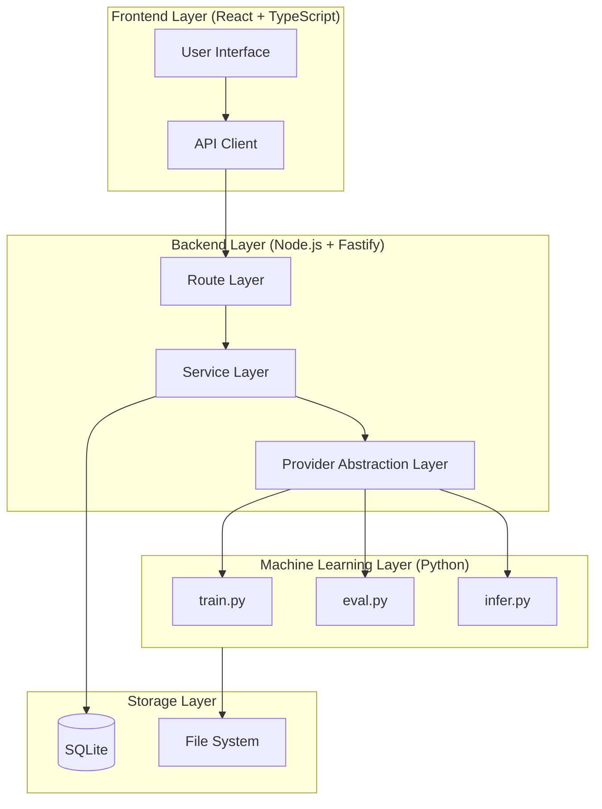
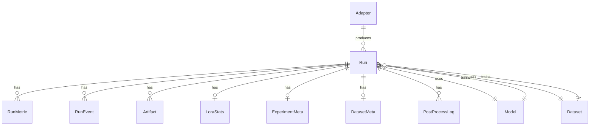
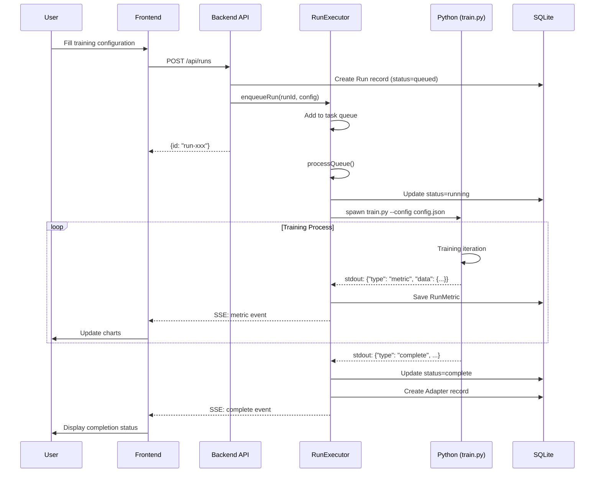
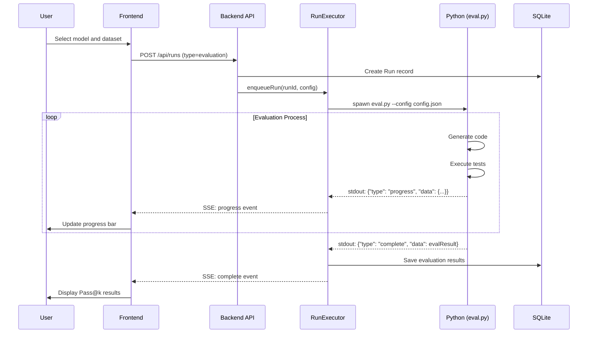

# LLMTrainPipeline Technical Documentation

> **End-to-End Large Language Model Fine-tuning and Evaluation Pipeline System**
> 
> This document provides a detailed introduction to the architecture design, technology stack, core algorithms, workflow, and implementation principles of this project, suitable for academic paper reference.

---

## Table of Contents

1. [Project Overview](#1-project-overview)
2. [System Architecture](#2-system-architecture)
3. [Technology Stack Details](#3-technology-stack-details)
4. [Database Design](#4-database-design)
5. [Core Module Details](#5-core-module-details)
6. [Training Process and Algorithms](#6-training-process-and-algorithms)
7. [Evaluation Process and Metrics](#7-evaluation-process-and-metrics)
8. [Data Format Support](#8-data-format-support)
9. [Configuration Parameters](#9-configuration-parameters)
10. [API Interface Design](#10-api-interface-design)
11. [Frontend Interface Design](#11-frontend-interface-design)
12. [Workflow Diagrams](#12-workflow-diagrams)

---

## 1. Project Overview

### 1.1 Project Goals

LLMTrainPipeline is an **end-to-end large language model fine-tuning and evaluation pipeline system**, designed to provide:

- 🎯 **Model Training**: Efficient parameter fine-tuning based on LoRA/QLoRA
- 📊 **Model Evaluation**: Pass@k code generation evaluation and error classification analysis
- 📈 **Real-time Monitoring**: Real-time tracking and visualization of training metrics
- 📝 **Report Generation**: Automatic generation of detailed academic-grade training reports
- 🔧 **Model Inference**: Interactive code generation testing Playground
- 📁 **Data Management**: Multi-format dataset automatic detection and conversion

### 1.2 Design Philosophy

```
┌─────────────────────────────────────────────────────────────────┐
│                     User Interface Layer (React)                 │
│  Dashboard │ NewRun │ Runs │ Evaluation │ Playground │ Compare  │
└─────────────────────────────────────────────────────────────────┘
                              ▼
┌─────────────────────────────────────────────────────────────────┐
│                      API Gateway Layer (Fastify)                 │
│   /runs │ /models │ /datasets │ /adapters │ /reports │ /playground│
└─────────────────────────────────────────────────────────────────┘
                              ▼
┌─────────────────────────────────────────────────────────────────┐
│                       Service Layer (TypeScript)                 │
│    RunExecutor │ AdapterGuard │ NotificationService │ Scanner   │
└─────────────────────────────────────────────────────────────────┘
                              ▼
┌─────────────────────────────────────────────────────────────────┐
│                     Provider Abstraction Layer                   │
│  TrainerProvider(LoRA) │ EvalProvider(PassK) │ Cache │ Artifact │
└─────────────────────────────────────────────────────────────────┘
                              ▼
┌─────────────────────────────────────────────────────────────────┐
│                      ML Execution Layer (Python)                 │
│        train.py │ eval.py │ infer.py │ report_generator.py      │
└─────────────────────────────────────────────────────────────────┘
                              ▼
┌─────────────────────────────────────────────────────────────────┐
│                      Data Persistence Layer                      │
│              SQLite (Prisma ORM) │ File System (storage/)        │
└─────────────────────────────────────────────────────────────────┘
```

---

## 2. System Architecture

### 2.1 Overall Architecture Diagram



### 2.2 Directory Structure

```
LLMTrainPipeline/
├── App.tsx                 # React application entry
├── pages/                  # Frontend page components (13)
│   ├── Dashboard.tsx       # Dashboard
│   ├── NewRun.tsx          # Create new training task
│   ├── RunDetail.tsx       # Training details
│   ├── Evaluation.tsx      # Evaluation task
│   ├── EvalDetail.tsx      # Evaluation details
│   ├── Playground.tsx      # Model inference testing
│   ├── Compare.tsx         # Run comparison
│   ├── Models.tsx          # Model management
│   ├── Datasets.tsx        # Dataset management
│   ├── Adapters.tsx        # Adapter management
│   ├── Reports.tsx         # Report management
│   ├── Runs.tsx            # Run list
│   └── Settings.tsx        # System settings
├── components/             # Common components
│   ├── Layout.tsx          # Layout component
│   ├── CommandPalette.tsx  # Command palette
│   └── NotificationPanel.tsx # Notification panel
├── lib/
│   └── api.ts              # API client (50+ functions)
├── backend/
│   ├── src/
│   │   ├── index.ts        # Fastify service entry
│   │   ├── routes/         # API routes (13 modules)
│   │   ├── services/       # Business services (6)
│   │   ├── providers/      # Provider abstraction layer
│   │   ├── config/         # Configuration management
│   │   └── types/          # Type definitions
│   ├── scripts/            # Python ML scripts
│   │   ├── train.py        # Training script (926 lines)
│   │   ├── eval.py         # Evaluation script (2139 lines)
│   │   ├── infer.py        # Inference script
│   │   ├── format_registry.py  # Data format registry (1055 lines)
│   │   └── report_generator.py # Report generator (2205 lines)
│   ├── prisma/
│   │   └── schema.prisma   # Database models (16)
│   └── storage/            # Data storage directory
│       ├── models/         # Base model weights
│       ├── adapters/       # LoRA adapters
│       ├── datasets/       # Training datasets
│       └── runs/           # Training run records
└── package.json            # Project configuration
```

---

## 3. Technology Stack Details

### 3.1 Frontend Technology Stack

| Technology | Version | Purpose |
|------------|---------|---------|
| **React** | 19.2.3 | UI framework |
| **TypeScript** | 5.8.2 | Type safety |
| **Vite** | 6.2.0 | Build tool |
| **React Router** | 7.12.0 | Route management |
| **Recharts** | 3.6.0 | Chart visualization |
| **React Markdown** | 10.1.0 | Markdown rendering |
| **React Syntax Highlighter** | 16.1.0 | Code highlighting |

### 3.2 Backend Technology Stack

| Technology | Version | Purpose |
|------------|---------|---------|
| **Node.js** | ≥18.0.0 | Runtime |
| **Fastify** | 4.27.0 | Web framework |
| **Prisma** | 5.14.0 | ORM database access |
| **SQLite** | - | Embedded database |
| **Zod** | 3.23.8 | Data validation |
| **UUID** | 9.0.1 | Unique ID generation |
| **Archiver** | 7.0.1 | Compression packaging |

### 3.3 Machine Learning Technology Stack

| Technology | Version Requirement | Purpose |
|------------|---------------------|---------|
| **Python** | ≥3.11 | Programming language |
| **PyTorch** | ≥2.0.0 | Deep learning framework |
| **Transformers** | ≥4.36.0 | Pre-trained model library |
| **PEFT** | ≥0.7.0 | LoRA/QLoRA implementation |
| **TRL** | Latest | SFTTrainer trainer |
| **bitsandbytes** | ≥0.41.0 | Quantization support |
| **Accelerate** | ≥0.25.0 | Distributed training |
| **Datasets** | ≥2.15.0 | Dataset loading |

---

## 4. Database Design

### 4.1 Core Data Models (Prisma Schema)

The system uses SQLite database, accessed through Prisma ORM. A total of **16 data models** are defined:

#### 4.1.1 Run (Training/Evaluation Run)

```prisma
model Run {
  id              String           @id @default(uuid())
  name            String           # Run name
  type            String           # "training" | "evaluation"
  status          String           @default("queued")  # queued/running/complete/failed
  createdAt       DateTime         @default(now())
  startedAt       DateTime?
  completedAt     DateTime?
  duration        String?
  
  modelId         String           # Associated base model
  datasetId       String           # Associated dataset
  evalDatasetId   String?          # Evaluation dataset (optional)
  profileName     String           @default("single_gpu")
  configJson      String           # Complete configuration JSON
  metricsJson     String?          # Training metrics summary
  evalResultJson  String?          # Evaluation results
  
  seed            Int?             # Random seed
  gitCommit       String?          # Git commit hash
  totalTokens     Int?             # Total token count
  totalSteps      Int?             # Total training steps
  gpuHours        Float?           # GPU usage hours
  tokensPerSecond Float?           # Throughput
  sourceRunId     String?          # Source training run ID
  queuePosition   Int?             # Queue position
  
  # Relationships
  artifacts       Artifact[]
  metrics         RunMetric[]
  events          RunEvent[]
  loraStats       LoraStats?
  experimentMeta  ExperimentMeta?
  datasetMeta     DatasetMeta?
}
```

#### 4.1.2 Model

```prisma
model Model {
  id           String   @id @default(uuid())
  name         String   @unique
  backend      String   # "transformers"
  source       String   # "local" | "huggingface"
  quantization String   # "none" | "4bit" | "8bit"
  params       String   # Parameter count description
  path         String   # Model path
  status       String   @default("valid")
  metaJson     String?  # Metadata JSON
}
```

#### 4.1.3 Dataset

```prisma
model Dataset {
  id        String   @id @default(uuid())
  name      String   @unique
  version   String
  type      String   # "train" | "eval"
  status    String   @default("ready")
  samples   Int      # Sample count
  format    String   # Data format
  size      String   # File size
  path      String   # File path
  hash      String   # File hash
}
```

#### 4.1.4 Adapter (LoRA Adapter)

```prisma
model Adapter {
  id           String   @id @default(uuid())
  name         String   @unique
  baseModel    String   # Base model name
  trainDataset String   # Training dataset
  rank         Int      # LoRA rank
  alpha        Int      # LoRA alpha
  status       String   @default("success")
  passAt1      Float?   # Pass@1 evaluation result
  compileRate  Float?   # Compile pass rate
  path         String?  # Adapter path
}
```

#### 4.1.5 LoraStats (LoRA Statistics)

```prisma
model LoraStats {
  id               String  @id @default(uuid())
  runId            String  @unique
  rank             Int?
  alpha            Int?
  dropout          Float?
  targetModules    String? # JSON array
  trainableParams  BigInt? # Trainable parameter count
  totalParams      BigInt? # Total parameter count
  trainablePercent Float?  # Trainable ratio
}
```

#### 4.1.6 ExperimentMeta (Experiment Metadata)

```prisma
model ExperimentMeta {
  id                  String    @id @default(uuid())
  runId               String    @unique
  osVersion           String?
  pythonVersion       String?
  pytorchVersion      String?
  transformersVersion String?
  trlVersion          String?
  peftVersion         String?
  cudaVersion         String?
  cudnnVersion        String?
  bitsandbytesVersion String?
  gpuModel            String?
  gpuMemoryGB         Float?
  cpuModel            String?
  ramGB               Float?
  startTime           DateTime?
  endTime             DateTime?
}
```

### 4.2 ER Relationship Diagram



---

## 5. Core Module Details

### 5.1 Backend Service Layer (services/)

#### 5.1.1 RunExecutor (Task Executor)

**File**: `backend/src/services/run-executor.ts` (1539 lines)

Core responsibilities:
- **Task Queue Management**: Maintains in-memory queue `runQueue[]`, supports task queuing, reordering, cancellation
- **Log Buffering**: Uses `LogEventBuffer` for batch log writing, solving SQLite high-frequency write pressure
- **Process Management**: Starts Python scripts via `spawn`, supports real-time stdout parsing
- **Event Distribution**: Uses `EventEmitter` for SSE real-time log push

Key functions:

```typescript
// Queue task
async function enqueueRun(runId: string, profileName: string, configOverride: any): Promise<void>

// Process queue
async function processQueue(): Promise<void>

// Execute run (training/evaluation)
async function executeRun(runId: string, config: Config): Promise<void>

// Stop run
async function stopRun(runId: string): Promise<void>

// Get queue status
function getQueueStatus(): { queueLength: number; isProcessing: boolean }
```

#### 5.1.2 AdapterGuard (Adapter Guardian)

**File**: `backend/src/services/adapter-guard.ts`

Responsibility: Validates all LoRA adapter file integrity at startup, marks invalid adapters.

#### 5.1.3 NotificationService (Notification Service)

**File**: `backend/src/services/notification-service.ts`

Responsibility: Creates notifications on task completion/failure, supports frontend real-time alerts.

### 5.2 Provider Abstraction Layer (providers/)

#### 5.2.1 Interface Definitions

**File**: `backend/src/providers/interfaces.ts`

```typescript
// Trainer Provider interface
interface TrainerProvider {
    name: string;
    train(config: TrainConfig): AsyncGenerator<TrainEvent>;
    stop?(): void;
}

// Evaluator Provider interface
interface EvalProvider {
    name: string;
    evaluate(config: EvalConfig): Promise<EvalResult>;
    evaluateStream?(config: EvalConfig): AsyncGenerator<EvalEvent, EvalResult, unknown>;
    stop?(): void;
}

// Training event
interface TrainEvent {
    type: 'log' | 'metric' | 'checkpoint' | 'complete' | 'error' | 
          'experiment_log' | 'eval_log' | 'data_quality' | 'training_summary';
    timestamp: Date;
    data: any;
}

// Evaluation result
interface EvalResult {
    passAt1: number;
    compileRate: number;
    passAtK: Record<string, number>;
    errorStats?: ErrorStats;
    timeStats?: TimeStats;
    segmentStats?: {
        byDifficulty: Record<string, SegmentResult>;
        byCategory: Record<string, SegmentResult>;
    };
    failures: FailureCase[];
}
```

#### 5.2.2 LoraTrainer (LoRA Trainer)

**File**: `backend/src/providers/trainer/lora.ts` (467 lines)

Responsibilities:
- Build training configuration JSON
- Start `train.py` Python process
- Parse JSON events from stdout output
- Return training events via AsyncGenerator stream

```typescript
class LoraTrainer implements TrainerProvider {
    name = 'lora';
    
    async *train(trainConfig: TrainConfig): AsyncGenerator<TrainEvent> {
        // 1. Generate configuration file
        // 2. Spawn train.py process
        // 3. Parse stdout JSON events
        // 4. Yield TrainEvent
    }
}
```

#### 5.2.3 CodePassKEval (Code Evaluator)

**File**: `backend/src/providers/eval/code-passk.ts` (636 lines)

Responsibilities:
- Start `eval.py` Python process
- Real-time streaming of evaluation progress and problem results
- Parse final evaluation results

---

## 6. Training Process and Algorithms

### 6.1 Training Script Architecture

**File**: `backend/scripts/train.py` (926 lines)

```python
# Main entry
def train(config: dict):
    """
    Main training function
    1. Initialize ExperimentLogger
    2. Load model and tokenizer
    3. Configure LoRA adapter
    4. Prepare dataset (messages format)
    5. Train using TRL SFTTrainer
    6. Output experiment logs
    """
```

### 6.2 LoRA/QLoRA Configuration

```python
def setup_lora(model, lora_config: dict):
    """
    LoRA configuration parameters:
    - rank: 16 (default)
    - alpha: 32 (default)
    - dropout: 0.05 (default)
    - target_modules: ["q_proj", "k_proj", "v_proj", "o_proj", 
                       "gate_proj", "up_proj", "down_proj"]
    - bias: "none"
    """
    peft_config = LoraConfig(
        task_type=TaskType.CAUSAL_LM,
        r=rank,
        lora_alpha=alpha,
        lora_dropout=dropout,
        target_modules=target_modules,
        bias=bias,
    )
    model = get_peft_model(model, peft_config)
    return model
```

### 6.3 Quantization Configuration

```python
def get_quantization_config(quantization: str):
    """
    Supports 3 quantization modes:
    - "4bit" (QLoRA): NF4 quantization, uses double quantization
    - "8bit": INT8 quantization, supports CPU offload
    - "none": FP16 full precision
    """
    if quantization == "4bit":
        return BitsAndBytesConfig(
            load_in_4bit=True,
            bnb_4bit_quant_type="nf4",
            bnb_4bit_compute_dtype=torch.float16,
            bnb_4bit_use_double_quant=True,
        )
```

### 6.4 Training Parameters

| Parameter | Default | Description |
|-----------|---------|-------------|
| `epochs` | 3 | Number of training epochs |
| `batchSize` | 1 | Per-device batch size |
| `gradientAccumulation` | 8 | Gradient accumulation steps |
| `lr` | 2e-4 | Learning rate |
| `maxLength` | 512 | Maximum sequence length |
| `weightDecay` | 0.01 | Weight decay |
| `warmupRatio` | 0.03 | Warmup ratio |
| `scheduler` | "cosine" | Learning rate scheduler |
| `optimizer` | "paged_adamw_8bit" | Optimizer |
| `loggingSteps` | 10 | Logging interval |
| `saveSteps` | 100 | Checkpoint save interval |
| `saveTotalLimit` | 3 | Maximum checkpoint retention |
| `gradientClipping` | 1.0 | Gradient clipping threshold |

### 6.5 TRL SFTTrainer

```python
def train_with_sft(model, tokenizer, dataset, eval_dataset, output_dir, config):
    """
    Training using TRL SFTTrainer
    
    Key features:
    - Automatic loss masking (compute loss only on assistant replies)
    - Supports messages format datasets
    - Built-in gradient checkpointing
    - Supports early stopping callback
    """
    sft_config = SFTConfig(
        output_dir=output_dir,
        num_train_epochs=num_epochs,
        per_device_train_batch_size=batch_size,
        gradient_accumulation_steps=grad_accum,
        learning_rate=learning_rate,
        gradient_checkpointing=True,
        # ... more configuration
    )
    
    trainer = SFTTrainer(
        model=model,
        args=sft_config,
        train_dataset=dataset,
        eval_dataset=eval_dataset,
        processing_class=tokenizer,
        callbacks=[TrainingEventCallback()],
    )
    
    trainer.train()
```

### 6.6 Training Event Callback

```python
class TrainingEventCallback(TrainerCallback):
    """
    Training event callback, outputs JSON format events to stdout
    for TypeScript backend parsing
    """
    
    def on_log(self, args, state, control, logs=None, **kwargs):
        # Output metric event
        event = {
            "type": "metric",
            "data": {
                "step": state.global_step,
                "loss": logs.get('loss'),
                "lr": logs.get('learning_rate'),
                "grad_norm": logs.get('grad_norm'),
                "epoch": logs.get('epoch')
            }
        }
        print(json.dumps(event), flush=True)
    
    def on_save(self, args, state, control, **kwargs):
        # Output checkpoint event
        event = {
            "type": "checkpoint",
            "data": {
                "path": f"checkpoint-{state.global_step}",
                "step": state.global_step,
                "epoch": state.epoch
            }
        }
        print(json.dumps(event), flush=True)
```

---

## 7. Evaluation Process and Metrics

### 7.1 Evaluation Script Architecture

**File**: `backend/scripts/eval.py` (2139 lines)

### 7.2 Core Evaluation Metrics

#### 7.2.1 Pass@k Calculation

```python
def pass_at_k(n: int, c: int, k: int) -> float:
    """
    Calculate Pass@k estimate
    
    Parameters:
        n: Number of samples per problem
        c: Number of passing samples
        k: k value
    
    Returns:
        Pass@k probability estimate
    
    Formula: 1 - C(n-c, k) / C(n, k)
    """
    if n - c < k:
        return 1.0
    return 1.0 - comb(n - c, k) / comb(n, k)
```

#### 7.2.2 Error Type Classification

```python
class ErrorType(Enum):
    """Error type enumeration"""
    NONE = "none"
    SYNTAX_ERROR = "syntax_error"       # Syntax error
    RUNTIME_ERROR = "runtime_error"     # Runtime error
    TIMEOUT = "timeout"                 # Timeout
    INVALID_OUTPUT = "invalid_output"   # Output format error
    ASSERTION_ERROR = "assertion_error" # Assertion failure
    IMPORT_ERROR = "import_error"       # Import error
    MEMORY_ERROR = "memory_error"       # Memory error
```

#### 7.2.3 Evaluation Result Structure

```python
@dataclass
class EvalResult:
    # Basic metrics
    pass_at_1: float           # Pass@1
    pass_at_5: float           # Pass@5
    pass_at_10: float          # Pass@10
    compile_rate: float        # Compile pass rate
    
    # Error statistics
    error_stats: ErrorStats
    
    # Time statistics
    time_stats: TimeStats
    
    # Segment statistics (by difficulty/category)
    segment_stats: Dict[str, SegmentResult]
    
    # Failure cases
    failures: List[FailureCase]
```

### 7.3 Code Execution and Validation

#### 7.3.1 Dual Style Code Support

The system supports both **functional** and **stdin/stdout style** code:

```python
def _adapt_code_for_stdin_test(code: str, inp: str) -> str:
    """
    Smart code style adaptation
    
    When model generates functional code (e.g., def solve(...)),
    but test expects stdin/stdout style,
    automatically generates wrapper code.
    """
    has_def = bool(re.search(r'\bdef\s+\w+\s*\(', code))
    has_input = bool(re.search(r'\binput\s*\(', code))
    has_print = bool(re.search(r'\bprint\s*\(', code))
    
    if has_def and not has_input:
        # Functional code, needs wrapper
        return _generate_function_wrapper(code, fn_name, inp)
    
    return code
```

#### 7.3.2 Test Case Parsing

Supports multiple test formats:

```python
def parse_json_test(test_str: str, solution_code: str, idx: int = 0) -> str:
    """
    Parse test cases, supported formats:
    - TACO: {"type": "stdin_stdout", "input": "...", "expected_output": "..."}
    - HumanEval: {"input": [...], "output": ...}
    - MBPP: {"inputs": [...], "outputs": [...]}
    - Function call: {"fn_name": "solve", "input": [...], "expected_output": ...}
    - Raw assert statements
    """
```

### 7.4 Evaluation Configuration Parameters

| Parameter | Default | Description |
|-----------|---------|-------------|
| `numSamples` | 5 | Samples per problem |
| `k` | "1,5,10" | k values for Pass@k |
| `temperature` | 0.2 | Sampling temperature |
| `maxTokens` | 512 | Maximum generation tokens |
| `timeout` | 10 | Execution timeout (seconds) |
| `memoryLimit` | - | Memory limit |

---

## 8. Data Format Support

### 8.1 Data Format Registry

**File**: `backend/scripts/format_registry.py` (1055 lines)

The system supports **20+** common LLM training data formats, categorized as follows:

### 8.2 Conversation Formats

| Format Name | Required Fields | Description |
|-------------|-----------------|-------------|
| `messages` | `messages[]` | Standard OpenAI messages format |
| `sharegpt` | `conversations[]` | ShareGPT conversation format |
| `openai_chatml` | `system`, `user`, `assistant` | OpenAI ChatML |
| `dialog_turns` | `dialog[]` or `turns[]` | Multi-turn dialogue |
| `history_response` | `history`, `response` | History + response format |

### 8.3 Instruction Formats

| Format Name | Required Fields | Description |
|-------------|-----------------|-------------|
| `alpaca` | `instruction`, `output` | Alpaca format |
| `dolly` | `context`, `instruction`, `response` | Dolly format |
| `wizardlm` | `instruction`, `response`, `complexity` | WizardLM format |

### 8.4 Code Formats

| Format Name | Required Fields | Description |
|-------------|-----------------|-------------|
| `humaneval` | `prompt`, `canonical_solution` | HumanEval benchmark |
| `mbpp` | `text`, `code` | MBPP dataset |
| `taco` | `question`, `solutions` | TACO competition data |
| `code_completion` | `prefix`, `suffix` | Code completion |
| `code_instruct` | `instruction`, `code` | Code instruction |

### 8.5 Q&A Formats

| Format Name | Required Fields | Description |
|-------------|-----------------|-------------|
| `qa_basic` | `question`, `answer` | Basic Q&A |
| `qa_with_context` | `context`, `question`, `answer` | Q&A with context |
| `qa_choices` | `question`, `choices`, `answer` | Multiple choice |

### 8.6 Format Auto-Detection

```python
class DatasetFormatRegistry:
    """
    Dataset format registry
    
    Automatically detects dataset format and converts to standard messages format
    """
    
    def detect_format(self, sample: dict) -> str:
        """
        Detect sample format
        Try to match each format by priority order
        """
        for format_info in self.formats:
            if format_info.detector(sample):
                return format_info.name
        return "unknown"
    
    def convert_to_messages(self, sample: dict, format_name: str) -> List[dict]:
        """
        Convert sample to standard messages format
        """
        format_info = self.get_format(format_name)
        return format_info.converter(sample, self.default_system_prompt)
```

---

## 9. Configuration Parameters

### 9.1 Training Configuration Parameters

#### 9.1.1 Basic Training Parameters

| Parameter | Type | Default | Description |
|-----------|------|---------|-------------|
| `epochs` | int | 3 | Number of training epochs |
| `batchSize` | int | 1 | Per-device batch size |
| `gradientAccumulation` | int | 8 | Gradient accumulation steps |
| `lr` | string | "2e-4" | Learning rate |
| `maxLength` | int | 512 | Maximum sequence length |
| `weightDecay` | float | 0.01 | Weight decay |

#### 9.1.2 LoRA Configuration

| Parameter | Type | Default | Description |
|-----------|------|---------|-------------|
| `rank` | int | 16 | LoRA rank (low-rank decomposition dimension) |
| `alpha` | int | 32 | LoRA alpha (scaling factor) |
| `dropout` | float | 0.05 | Dropout probability |
| `quantization` | string | "4bit" | Quantization mode: "4bit"/"8bit"/"none" |
| `targetModules` | array | ["q_proj",...] | Target modules list |
| `bias` | string | "none" | Bias training mode |

#### 9.1.3 Scheduler Configuration

| Parameter | Type | Default | Description |
|-----------|------|---------|-------------|
| `scheduler` | string | "cosine" | Learning rate scheduler type |
| `warmupType` | string | "ratio" | Warmup type: "ratio"/"steps" |
| `warmupRatio` | float | 0.03 | Warmup ratio |
| `warmupSteps` | int | 0 | Warmup steps |
| `optimizer` | string | "paged_adamw_8bit" | Optimizer type |

#### 9.1.4 Validation and Early Stopping

| Parameter | Type | Default | Description |
|-----------|------|---------|-------------|
| `evalStrategy` | string | "epoch" | Evaluation strategy: "no"/"steps"/"epoch" |
| `evalSteps` | int | 200 | Evaluation step interval |
| `earlyStoppingEnabled` | bool | false | Enable early stopping |
| `earlyStoppingPatience` | int | 3 | Early stopping patience |
| `earlyStoppingThreshold` | float | 0.0 | Early stopping threshold |
| `loadBestModelAtEnd` | bool | true | Load best model at end of training |

### 9.2 Evaluation Configuration Parameters

| Parameter | Type | Default | Description |
|-----------|------|---------|-------------|
| `evaluator` | string | "code_passk" | Evaluator type |
| `k` | string | "1,5,10" | k values for Pass@k |
| `numSamples` | int | 5 | Samples per problem |
| `temperature` | float | 0.2 | Sampling temperature |
| `maxTokens` | int | 512 | Maximum generation length |
| `timeout` | int | 10 | Execution timeout (seconds) |
| `generateReport` | bool | true | Generate report |
| `saveFailureCases` | bool | true | Save failure cases |

---

## 10. API Interface Design

### 10.1 Route Module List

| Route Prefix | Module File | Function |
|--------------|-------------|----------|
| `/api/dashboard` | dashboard.ts | Dashboard data |
| `/api/runs` | runs.ts | Training run management |
| `/api/models` | models.ts | Model management |
| `/api/datasets` | datasets.ts | Dataset management |
| `/api/adapters` | adapters.ts | Adapter management |
| `/api/compare` | compare.ts | Run comparison |
| `/api/reports` | reports.ts | Report management |
| `/api/settings` | settings.ts | System settings |
| `/api/config` | config.ts | Configuration management |
| `/api/playground` | playground.ts | Inference testing |
| `/api/search` | search.ts | Global search |
| `/api/files` | files.ts | File browsing |
| `/api/notifications` | notifications.ts | Notification management |

### 10.2 Core API Endpoints

#### 10.2.1 Training Run API

```
POST   /api/runs                    # Create new run
GET    /api/runs                    # Get run list
GET    /api/runs/:id                # Get run details
POST   /api/runs/:id/stop           # Stop run
DELETE /api/runs/:id                # Delete run
POST   /api/runs/:id/clone          # Clone run
GET    /api/runs/:id/metrics        # Get training metrics
GET    /api/runs/:id/eval           # Get evaluation results
GET    /api/runs/:id/logs/stream    # SSE real-time log stream
GET    /api/runs/queue              # Get queue status
POST   /api/runs/:id/reorder        # Reorder queue position
POST   /api/runs/:id/cancel-queue   # Cancel queue
```

#### 10.2.2 Model Management API

```
GET    /api/models                  # Get model list
POST   /api/models/rescan           # Rescan models
POST   /api/models/import           # Import model
DELETE /api/models/:id              # Delete model
```

#### 10.2.3 Playground API

```
POST   /api/playground/infer        # Model inference
POST   /api/playground/load         # Load model
POST   /api/playground/unload       # Unload model
GET    /api/playground/status       # Get status
```

### 10.3 SSE Real-time Events

The system uses Server-Sent Events (SSE) for real-time log push:

```typescript
// Frontend connection example
const eventSource = new EventSource(`${API_BASE}/runs/${id}/logs/stream`);

eventSource.onmessage = (e) => {
    const event = JSON.parse(e.data);
    // event.type: 'log' | 'metric' | 'progress' | 'complete' | 'error'
    handleEvent(event);
};
```

---

## 11. Frontend Interface Design

### 11.1 Page Component List

| Component | File Size | Function |
|-----------|-----------|----------|
| Dashboard | 8KB | System overview dashboard |
| NewRun | 54KB | Create new training task wizard |
| RunDetail | 42KB | Training details and real-time logs |
| Evaluation | 28KB | Evaluation task creation |
| EvalDetail | 28KB | Evaluation result details |
| Playground | 36KB | Interactive model inference |
| Compare | 39KB | Run comparison analysis |
| Models | 10KB | Model management |
| Datasets | 13KB | Dataset management |
| Adapters | 13KB | Adapter management |
| Reports | 37KB | Report browsing and generation |
| Runs | 22KB | Run list and queue |
| Settings | 12KB | System settings |

### 11.2 Route Structure

```typescript
const routes = [
    { path: "/", component: Dashboard },
    { path: "/runs", component: Runs },
    { path: "/runs/:id", component: RunDetail },
    { path: "/runs/new", component: NewRun },
    { path: "/playground", component: Playground },
    { path: "/evaluation", component: Evaluation },
    { path: "/evaluation/:id", component: EvalDetail },
    { path: "/models", component: Models },
    { path: "/datasets", component: Datasets },
    { path: "/adapters", component: Adapters },
    { path: "/compare", component: Compare },
    { path: "/reports", component: Reports },
    { path: "/settings", component: Settings },
];
```

---

## 12. Workflow Diagrams

### 12.1 Complete Training Task Flow



### 12.2 Evaluation Task Flow



---

## Appendix A: Python Dependencies

**File**: `backend/scripts/requirements.txt`

```
# Core ML
torch>=2.0.0
transformers>=4.36.0
accelerate>=0.25.0
bitsandbytes>=0.41.0

# LoRA/PEFT
peft>=0.7.0

# Data
datasets>=2.15.0
pandas>=2.0.0

# Tokenization
sentencepiece>=0.1.99
tiktoken>=0.5.0

# Evaluation
jsonlines>=4.0.0

# Utilities
tqdm>=4.66.0
numpy>=1.24.0
scipy>=1.11.0

# Optional
# flash-attn>=2.3.0  # Flash Attention
# vllm>=0.2.0        # vLLM inference acceleration
```

---

## Appendix B: Environment Variable Configuration

```bash
# .env.local example

# API configuration
VITE_API_BASE_URL=http://localhost:3001/api

# Server configuration
PORT=3001
HOST=127.0.0.1

# Optional: AI features
GEMINI_API_KEY=your_api_key
```

---

## Appendix C: Quick Start Commands

```bash
# 1. Install dependencies
npm install                           # Frontend dependencies
cd backend && npm install            # Backend dependencies
cd backend/scripts && pip install -r requirements.txt  # Python dependencies

# 2. Initialize database
cd backend && npx prisma generate
cd backend && npx prisma db push

# 3. Start services
# Option 1: Use startup script (Windows)
./start.bat

# Option 2: Manual startup
cd backend && npm run dev    # Terminal 1: Backend
npm run dev                   # Terminal 2: Frontend

# 4. Access application
# http://localhost:4173
```

---

> **Document Version**: 1.0  
> **Generation Date**: 2026-01-24  
> **Project Name**: LLMTrainPipeline
